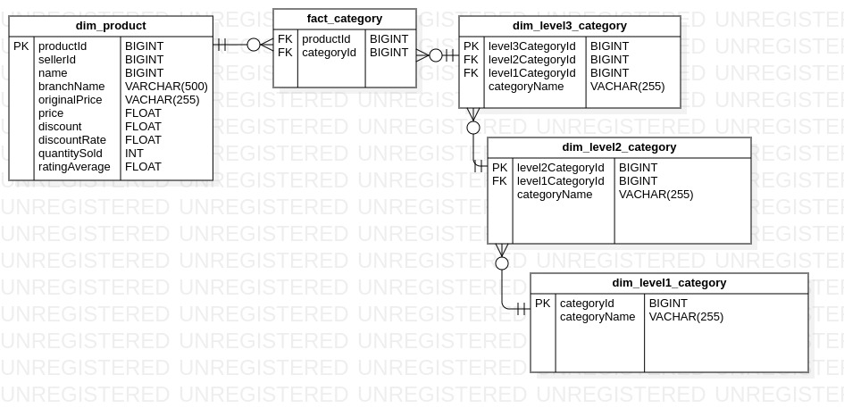

# TikiAPI-WebScraping

This project focuses on building a data engineering pipeline to crawl data from the TIKI e-commerce platform using the TIKI API, designing a data warehouse, implementing an ETL (Extract, Transform, Load) process, and loading the data into MySQL.

## Project Structure

The project structure is organized as follows:
```
Data-Engineer-Intern-Project/
|
├── crawler/
│ ├── CategoryLinkCrawler.py
│ └── ProductCrawler.py
|
├── data_warehouse/
│ └── createTableCommand.sql
│
├── etl/
│ ├── extractTransform.py
│ └── load.py
|
|── data/
| └── ...
└── ...
```

## Project Overview

The project consists of the following main processes:

1. **Crawl TIKI e-commerce data with TIKI API**: This process is divided into two steps:

   - The first step involves crawling all category links. Starting from the home page, the program traverses through subpages to gather all category links at. The results are saved in `category_home.csv` and `link_category.csv`.

   - In the second step, the program reads the collected links and crawls the product data, saving it to the `./dataRaw/` folder.

2. **Design data warehouse**: Data warehouse with dimentional category, include: fact_category, dim_product, dim_level1Category.csv, dim_level2Category.csv, dim_level3Category.csv
    

3. **ETL process**: The ETL process involves extracting the crawled data, transforming it into a suitable format, and loading it into the MySQL data warehouse.

